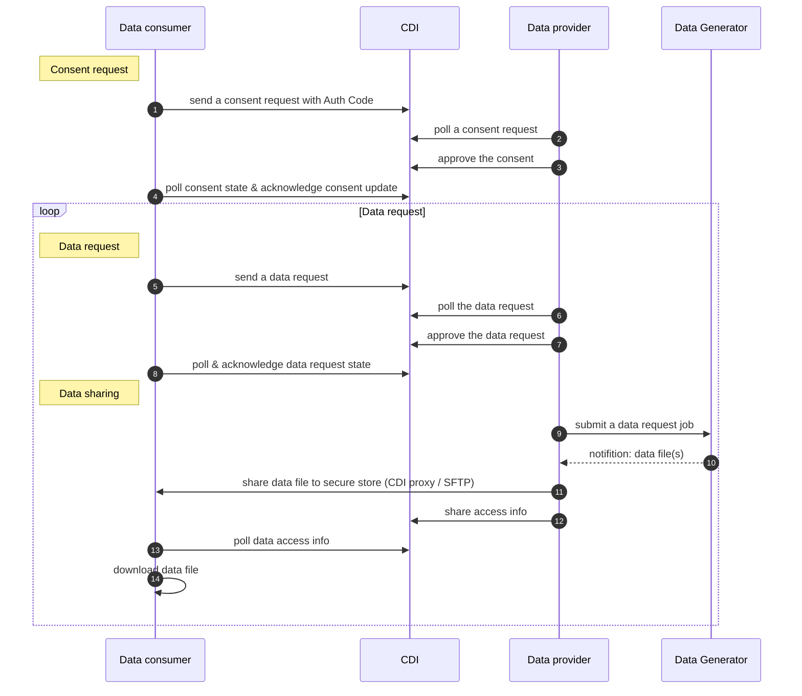

# CDI Integration

## Overview of the QFPay's CDI data consent & request flow



## Onboarding
- Data Consumer setup by providing Consumer
- Consider protocol for data file transfer, e.g. SFTP / HTTP
- Consider maximum file size limitation for data file transfer

## Consent Request

Sample payload of Consent
```json
{
    "consentId": "0152120c-490a-4225-90b5-f9e0c6968dc8",
    "type": "ConsentTypeSignedDocNotRequired",
    "dataConsumerId": "DC-SIM-001",
    "dataConsumerName": "simulator-c",
    "dataProviderId": "QFPAYHFL1004DP",
    "dataProviderName": "QFPay Haojin Finte",
    "scope": {
        "scopeType": "DataScopeTypeDateRange",
        "startDate": "2020-05-01",
        "endDate": "2024-10-30"
    },
    "hashKey": "8eccd695d4a3d5ab4b23ca06f480fffbb4e0d86b291263151e01d184f9554f3d",
    "status": "ConsentSubmitted",
    "expireTime": 1790132798,
    "private": {
        "id": "dbd609d0-d6b8-417d-b970-b8d928127eb8",
        "dataOwnerId": "1be5bb65-5e23-4e17-905b-30cd84ebafe1",
        "dataOwnerName": "Shop One",
        "consentFileList": [],
        "purposePrivate": "please fill the auth code",
        "secret": "5acf403de24cb97858c00f1860dbb747",
        "brNo" : "HKG:12345678",
        "dataOwnerReference": "1",
        "createTime": {
            "t": 1673245657,
            "humanT": "2023-01-09 14:27:36"
        },
        "updateTime": {
            "t": 1673245657,
            "humanT": "2023-01-09 14:27:36"
        }
    },
    "createTime": {
        "t": 1673245657,
        "humanT": "2023-01-09 14:27:36"
    },
    "updateTime": {
        "t": 1673245657,
        "humanT": "2023-01-09 14:27:36"
    }
}
```

## Auth Code

The authorization code (Auth Code) has been adapted to the data owner's authorization of data sharing consent and identification. 

Auth Code can be retrieved in QFPay merchant portal (MMS) anytime. It enables data owners to commit their consent confirmation online, to benefit from the full digital wordflow over the CDI and flexibility of Data Consent without a traditional phone call, or identification document check.

Data Consumer can submit the Auth Code via Consent request payload as below

```json
{
  "public": {
    ...
  },
  "private": {
    "dataOwnerId": "DO_001",
    "purposePrivate": "JNS76EAJ", <--- Auth Code
    "consentFileList": [
      ...
    ]
  }
}
```

### download a Auth Code

Data owner should login to QFPay merchant portal (MMS) to get the Auth Code. Please below the steps to get the Auth Code.

[Steps to get Auth Code](https://cdn.qfpay.com.hk/user_guide/Auth%20Code%20user%20guide.pdf)


## Data request
sample of data request payload
```json
{
	"private" : {
		"dataOwnerId": "1be5bb65-5e23-4e17-905b-30cd84ebafe1",
		"dataOwnerName" : "Shop One",
		"secret" : "de13f3c14e2cc802ecce638efdad24c4",
		"brNo" : "HKG:10000003",
		"id" : "57fe5232-f660-48bd-953e-9d03c84f8106",
		"createTime" : {
			"t" : 1697773625,
			"humanT" : "2023-10-20 11:47:05"
		},
		"updateTime" : {
			"t" : 1697773625,
			"humanT" : "2023-10-20 11:47:05"
		}
	},
	"purpose" : "2023-10-2047ac80da953a4519ac7e7003aeb0fb47",
	"dataScope" : {
		"scopeType" : "DataScopeTypeDateRange",
		"startDate" : "2023-04-23",
		"endDate" : "2023-10-19"
	},
	"consentId" : "1ec3e40c-8706-4b23-843e-35d5f7be5782",
  ...
}  
```

## Data access info

### using SFTP

#### prerequisite

- a SSH public key has been add to SFTP server
- a SFTP user has been created

#### access info example

```json
{
  "channel": "SFTP",
  "endPoint": "${SFTP_HOSTNAME}:${SFTP_PORT}",
  "accessToken": "SFTP_PRIVATE_KEY_NAME",
  "fileType": "csv",
  "filePath": "${uploadAbsoluteRemotePath}/${consumerId}/upload/TXN-V02-1130000459-20220401-20230309-1678327514554.csv",
  "fileHash": "$fileHash"
}

```

### using CDI Proxy

#### access info example

```json
{
  "channel": "HTTPS",
  "accessToken": "http_basic_authentication_password",
  "fileType": "csv",
  "endpointReverseProxy": " https://proxy-dataprovider-preprod.cdi.network/75f45deba96ff1b262b63180cb183ba4/OFPAYHFL1004DP/main data/ACCT12345 /data file 001.csv",
  "fileHash": "$fileHash",
  ...
}

```

### last file indicator

The last file `"filePath": "/upload/completed.csv"` is not physically exist. It indicates all data has been uploaded.

```json
{
    "channel": "SFTP",
    "endPoint": "${SFTP_HOSTNAME}:${SFTP_PORT}",
    "accessToken": "SFTP_PRIVATE_KEY_NAME",
    "fileType": "csv",
    "filePath": "/upload/completed.csv",
    "fileHash": "$fileHash"
  }
```

## Error codes

| rejectReasonCode 	| rejectReasonDetail [^1] & description 	|
|---	|---	|
| DataRequestRejectReasonInvalidConsent 	| INVALID_CONSENT 	|
| DataRequestRejectReasonInvalidScope 	| INVALID_DATE_RANGE 	|
| DataRequestRejectReasonCustomerNotFound 	| CUSTOMER_NOT_FOUND 	|
| DataRequestRejectReasonInvalidHashKeyOfRequestPrivate 	| FILE_CHECKSUM_FAILED 	|
| DataRequestRejectReasonInvalidPurpose 	| INVALID_PURPOSE_VALUE 	|
| DataRequestRejectReasonOthers 	| [^NO_DATA] - No data found from the data request scope OTHER_REASON 	|
|  	|  	|
| ConsentRejectReasonInvalidSignature 	| INVALID_SIGNATURE 	|
| ConsentRejectReasonInvalidExpireTime 	| INVALID_EXPIRE_TIME 	|
| ConsentRejectReasonInvalidScope 	| INVALID_DATE_RANGE 	|
| ConsentRejectReasonCustomerNotFound 	| CUSTOMER_NOT_FOUND 	|
| ConsentRejectReasonInvalidHashKey 	| FILE_CHECKSUM_FAILED 	|
| ConsentRejectReasonInvalidPurpose 	| INVALID_PURPOSE_VALUE 	|
| ConsentRejectReasonOthers 	| OTHER_REASON<br/>INFO_MISMATCH - BR/CI & Company name not match<br/>BR_NOT_FOUND<br/>CI_NOT_FOUND<br/>INVALID_INFO - some data is invalid / auth code is invalid<br/>MISSING_INFO - some data is missing 	|


[^1] example of explicit value in rejectReasonDetail:

[^NO_DATA] No data found from the data request scope
