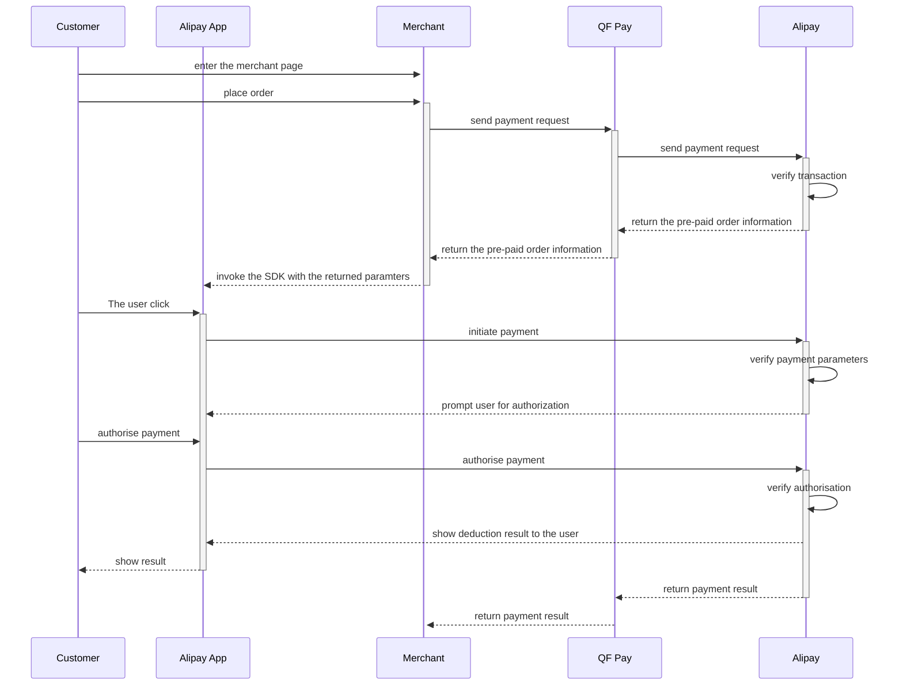

import Tabs from '@theme/Tabs';
import TabItem from '@theme/TabItem';
import Link from '@docusaurus/Link';

# Alipay Service Window H5

### flow chart

### Alipay Service Window H5 Payment (WAP)

Alipay Service Window H5 Payment enables merchants to call the Alipay payment module by using the JSAPI interface to collect payments. The customer checks out on the merchant's mobile website in Alipay, confirms the total amount and makes the payment.

### HTTP Request

`POST ../trade/v1/payment` `PayType: 800107`

**Step 1:** Get User ID
For more details about how to acquire the user id please refer to the [official Alipay documentation](https://docs.open.alipay.com/289/105656).

**Step 2:** Request Payment

### Payment Parameters

|Parameter name | Parameter code | Mandatory | Parameter type | Description |
|:----    |:---|:----- |-----   |----   |
|Public payment parameters |—  |— |—   |—   |
|Alipay authorization code|`openid`   |Yes  | String(64) |The `user_id` is returned by the interface, e.g. 2088802811715388 |
|Redirect URL | `return_url` | No | String(512) | Address for user redirect after successful payment |
|Designated payment method |`limit_pay`  |No |String   |Only applicable for mainland China   |

### Response Parameters

|Parameter name | Secondary parameter code | Parameter type | Parameter name | Description |
|:----    |:---|:----- |-----   |----   |
|`pay_params`|`tradeNO`   |String  | Transaction number| Provide the transaction number in the call function |
|`txcurrcd`  |  |  String(3) |   | Transaction currency. View the [Currencies](#currencies) table for a complete list of available currencies |
|Public response parameters |—  |— |—   |—   |

**Step 3:** Payout through the cashout interface
For more information regarding the cashout interface please refer to the [official Alipay documentation](https://docs.open.alipay.com/common/105591).

# Alipay Pre-Authorization

## Freeze Funds

At the moment only Alipay wallet funds can be used for pre-authorization, credit-cards are not supported. Authorization requests lose their validity after 15min. In case of technical or currency related integration difficulties please contact technical.support@qfpay.global for support. Merchants can, at any time, unfreeze the funds in which case the assets will be available for spending on the original wallet. In addition, merchants can initiate a transfer for a fraction or all of the frozen funds in order to collect money for open customer invoices.

:::note Alipay pre-authorization currently supports the following currencies: AUD, HKD, MYR, NZD, PHP, SGD, THB and USD:::

<Link href="/img/alipay_preauth_process.jpg" target="_blank"></Link> 

### HTTP Request

`POST ../trade/v1/payment`  

Find the correct `pay_type` for your checkout szenario from the table below.

PayType | Description 
--------- | ------- 
801801 | Alipay Pre-Authorization in-store QRC Payment - Consumer Present Mode (CPM)
801808 | Alipay Pre-Authorization in-store QRC Payment - Merchant Present Mode (MPM)  
801810 | Alipay Pre-Authorization in-APP Payment
801814 | Alipay Pre-Authorization Online Payment